-----
## Pod
Pod는 독립적인 서비스를 지닌 컨테이너(Container)의 묶음을 의미한다.

### Container
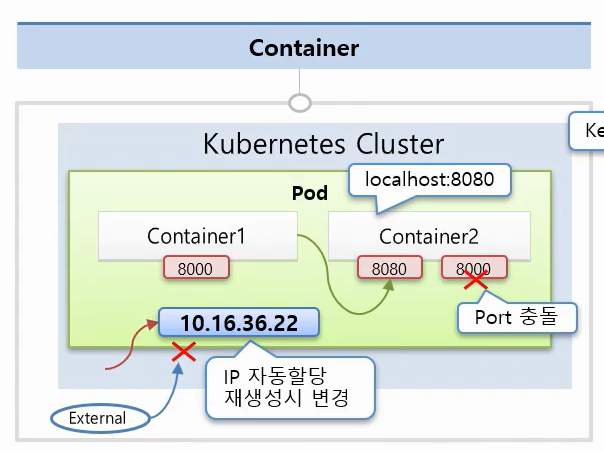{: .border .normal w="800" h="650" }  
 - 컨테이너는 애플리케이션 서비스와 연결될 수 있도록 개별적인 Port를 가지고 있다.
 - 컨테이너는 여러 개의 Port를 가질 수 있지만, 동일한 Pod 내에서 다른 컨테이너와 Port 중복은 허용하지 않는다.
 - Pod 내부의 컨테이너는 동일한 Host로 묶여있으며, 컨테이너 사이를 **localhost**로 접근할 수 있다.
 - Pod가 생성될 때, 고유의 IP 주소가 할당되고 쿠버네티스 클러스터를 통해서만 IP -> Pod에 접근할 수 있다. (외부에서는 해당 IP로 접근할 수 없다.)
 - Pod에 문제가 발생하면 쿠버네티스 시스템은 해당 Pod를 삭제하고 재생성하며 IP는 재생성된다. (IP 휘발성)

```yaml
# Pod 생성
apiVersion: v1
kind: Pod
metadata:
  name: pod-1
spec:
  containers:
    - name: container1 # 컨테이너-1
      image: kubetm/p8000 # 컨테이너-1 이미지
      ports:
        - containerPort: 8000 # 컨테이너-1 포트
    - name: container2 # 컨테이너-2
      image: kubetm/p8080 # 컨테이너-2 이미지
      ports:
        - containerPort: 8080 # 컨테이너-2 포트
```

### Label
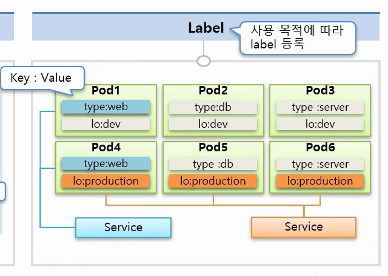{: .border .normal w="800" h="650" }  
 - Pod 뿐만 아니라 모든 오브젝트에 마킹할 수 있다.
 - 하나의 Pod는 여러 개의 Label을 가질 수 있다.
 - 목적에 따라 오브젝트를 분류하고 분류된 오브젝트를 연결할 수 있다.
 - key-value 쌍으로 이루어 진다.

```yaml
# Label 추가
apiVersion: v1
kind: Pod
metadata:
  name: pod-2
  labels:
    type: web # 라벨-1
    lo: dev # 라벨-2
spec:
  containers:
    - name: container
      image: kubetm/init
```

### Node Schedule
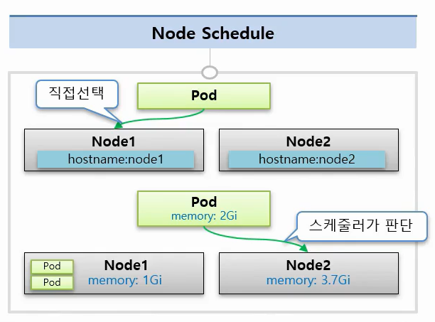{: .border .normal w="800" h="650" }  
1. Pod가 생성될 노드를 직접 선택하는 방법
```yaml
# nodeSelector를 통한 node 선택
apiVersion: v1
kind: Pod
metadata:
  name: pod-3
spec:
 nodeSelector: # nodeSelector
  hostname: node1
 containers:
 - name: container1
   image: tmkube/p8000
```
2. 스케줄러가 판단하여 노드를 선택하는 방법
 - 노드의 메모리와 **request.memory**, **limits.memory** 를 통해 생성될 Pod를 결정한다.
 - 메모리가 limits를 초과하면 Pod를 종료시키고 CPU는 requests 수치까지 낮춘다.  

```yaml
# 스케줄러 판단을 통한 node 선택
apiVersion: v1
kind: Pod
metadata:
 name: pod-4
spec:
 containers:
 - name: container1
   image: tmkube/p8000
   reources:
    requests: 
      memory: 2Gi # 요구 리소스
    limits:
      memory: 3Gi # 최대 허용 리소스
```

## Service

### ClusterIP
{: .border .normal w="800" h="650" }  
 - Service는 기본적으로 ClusterIP를 가지고 있으며 이것을 통해 Pod에 접근할 수 있다. 
 - 쿠버네티스 클러스터 내부에서만 접근을 허용한다.  
 - **Pod 내부에도 접근할 수 있는 IP가 존재하지만 Pod의 IP는 재생성되면 변경되는 휘발성 IP라서 Service의 IP를 사용하는 편이 접근에 대한 신뢰성을 높이는 방법이다.**
 - 외부에서 접근할 수 없으므로 운영자와 같은 인가된 사용자가 사용하기 적합하다. (쿠버네티스 대시보드 관리, Pod 상태 디버깅)

```yaml
# Service 생성 (ClusterIP)
apiVersion: v1
kind: Service
metadata:
  name: svc-1
spec:
  selector:
    app: pod # Label을 통하여 Pod와 연결
  ports:
  - port: 9000 # Service로 port 9000 인입 시,
    targetPort: 8080 # Pod 8080으로 연결
  type: ClusterIP # default 값 생략 가능
```

```yaml
# Pod 생성
apiVersion: v1
kind: Pod
metadata:
  name: pod-1
  labels:
     app: pod # Service와 연결을 위한 Label 설정
spec:
  nodeSelector:
    kubernetes.io/hostname: k8s-node1
  containers:
  - name: container
    image: kubetm/app
    ports:
    - containerPort: 8080
```

### NodePort
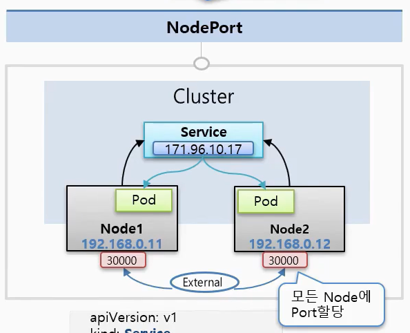{: .border .normal w="800" h="650" }  
 - 기본적으로 **ClusterIP** 특징을 가져온다. NodePort 타입으로 서비스를 생성해도 기본적으로 ClusterIP는 할당된다.
 - 쿠버네티스 클러스터에 연결되어 있는 모든 노드에게 똑같은 연결 Port가 할당이 되고 외부에서 어느 노드이던간에 노드IP:Port로 연결을 하면 NodePort 서비스와 연결되는 것을 보장한다. (**Pod가 상주해있는 노드뿐만 아니라 모든 노드에 같은 Port를 할당시키는 것**)
 - 물리적인 Host IP를 통해서 Pod에 접근할 수 있지만 보통 Host IP를 내부망에서만 접근할 수 있도록 구성하기 때문에 한계가 있다.
 - 주로 내부망 연결용으로 사용하거나 데모 또는 외부 임시 연결용으로 사용된다.

```yaml
# Service 생성 (NodePort)
apiVersion: v1
kind: Service
metadata:
  name: svc-2
spec:
  selector:
    app: pod
  ports:
  - port: 9000
    targetPort: 8080
    nodePort: 30000 # NodePort 지정 (30000~32767)
  type: NodePort # NodePort 타입의 서비스임을 명시 
  externalTrafficPolicy: Local
```
 - `externalTrafficPolicy` 옵션을 Local으로 설정하면 요청을 받은 노드와 그 노드가 가지고 있는 Pod에게 트래픽을 전달한다. NodePort 서비스는 여러 노드로부터 트래픽을 받고 서비스는 연결되어 있는 Pod에게 임의로 분배하는 것이 기본이다. **만약 해당 옵션을 활성화 시켰는데 해당 노드에 매핑된 Pod가 없다면 접근 자체가 안되니 주의할 필요가 있다.**

### Load Balancer
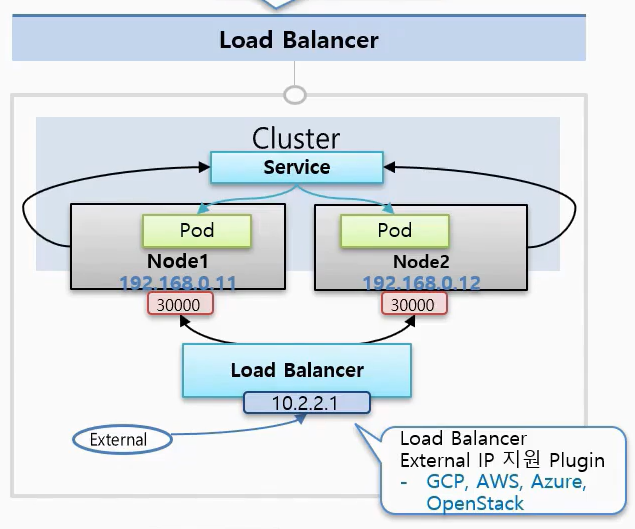{: .border .normal w="800" h="650" }  
 - 기본적으로 **NodePort** 특징을 가져온다.
 - Load Balancer를 통하여 트래픽 분산
 - Load Balancer 접근을 위한 외부 접속 IP는 GCP, AWS, Azure 등의 플러그인을 통해 설정해야 한다.
 - 외부 시스템 노출용

```yaml
# Service 생성 (Load Balancer)
apiVersion: v1
kind: Service
metadata:
  name: svc-3
spec:
  selector:
    app: pod
  ports:
  - port: 9000
    targetPort: 8080
  type: LoadBalancer
```

## Volume

### emptyDir
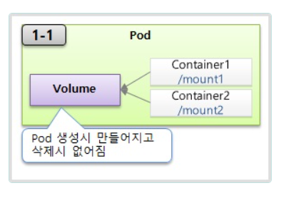{: .border .normal w="800" h="650" }  
 - Pod 내부의 Volumn을 사용하여 컨테이너 간 volume을 공유하는 방식
 - Pod 내부에 생성되기 때문에 Pod 장애 발생 시, 해당 Volume은 사라지기 때문에 일시적인 사용 목적을 가진 대상만 취급하는 것이 좋다.

```yaml
# emptyDir Volume + Pod 생성
apiVersion: v1
kind: Pod
metadata:
  name: pod-volume-1
spec:
  containers:
    - name: container1
      image: kubetm/init
      volumeMounts:
        - name: empty-dir # Pod의 마운트 명
          mountPath: /mount1 # container1 내부의 마운트 경로
    - name: container2
      image: kubetm/init
      volumeMounts:
        - name: empty-dir # Pod의 마운트 명
          mountPath: /mount2 # container2 내부의 마운트 경로
  volumes:
    - name : empty-dir # Pod의 마운트 명
      emptyDir: {}
```

### hostPath
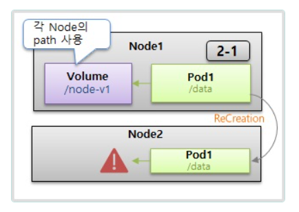{: .border .normal w="800" h="650" }    
 - Host Node의 Volume을 사용하는 방식
 - Pod → Node 마운트를 하기 때문에 Pod가 장애가 발생해도 Node의 Volumn은 사라지지 않는다.
 - 단, Pod가 재생성될 때 다른 Node에 생성될 수 있으며 다른 Node에 생성된 Pod는 기존에 사용하던 Volumn에 접근할 수 없다. (Node간 마운트를 통해 어느정도 해결이 가능하지만 관리 포인트가 늘어나는 셈이다.)
 - 일반적으로 Pod가 **자신이 할당되어 있는 Host Node의 데이터를 읽거나 쓸 때** 사용된다. Pod의 데이터를 Volumn에 저장하기 보단 Node에 있는 메타 데이터를 Pod에서 사용하기 위해 사용되곤 한다.

```yaml
# host-path Volume + Pod 생성
apiVersion: v1
kind: Pod
metadata:
  name: pod-volume-3
spec:
  nodeSelector:
    kubernetes.io/hostname: k8s-node1
  containers:
  - name: container
    image: kubetm/init
    volumeMounts:
    - name: host-path # 마운트할 volumn 명
      mountPath: /mount1 # container 내부의 마운트 경로
  volumes:
  - name : host-path # 마운트할 volumn 명
    hostPath:
      path: /node-v # Node에 생성되는 마운트 Volumn 명
      type: DirectoryOrCreate # 경로에 폴더가 없으면 생성
```

### PVC / PV
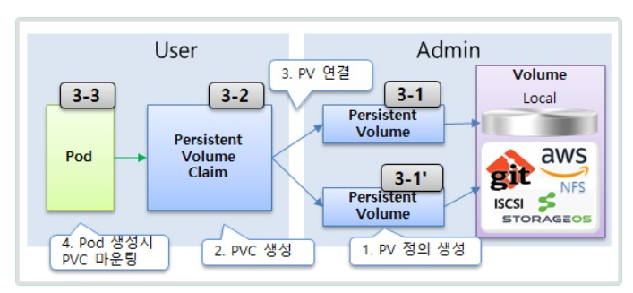{: .border .normal w="800" h="650" }  
 - PersistentVolumeClaim / PersistentVolume
 - Pod에게 영속성 있는 Volumn을 제공하기 위해 사용한다. (Pod → PVC → PV → Volumn)
 - Admin 영역 : PV를 통해 Volumn 속성을 정의하고 연결하는 역할이며 관리자가 다루는 영역이다.
 - User 영역 : PVC를 통해 정의된 PV를 사용하고 사용자가 다루는 영역이다. 
 
```yaml
# PV 정의
apiVersion: v1
kind: PersistentVolume
metadata:
  name: pv-03
spec:
  capacity:
    storage: 2G
  accessModes:
    - ReadWriteOnce
  local: # host-path와 유사함
    path: /node-v
  nodeAffinity:
    required:
      nodeSelectorTerms:
        - matchExpressions:
            - {key: kubernetes.io/hostname, operator: In, values: [vm-k8s-node-1]} # node-1에 생성
```

```yaml
# PVC 정의
apiVersion: v1
kind: PersistentVolumeClaim
metadata:
  name: pvc-01
spec:
  accessModes:
  - ReadWriteOnce
  resources:
    requests:
      storage: 1G
  storageClassName: ""
```

```yaml
# PVC-PV Volume + Pod 생성
apiVersion: v1
kind: Pod
metadata:
  name: pod-volume-3
spec:
  containers:
  - name: container
    image: kubetm/init
    volumeMounts:
    - name: pvc-pv
      mountPath: /mount3
  volumes:
  - name : pvc-pv
    persistentVolumeClaim: # 사용할 PVC 선택
      claimName: pvc-01
```

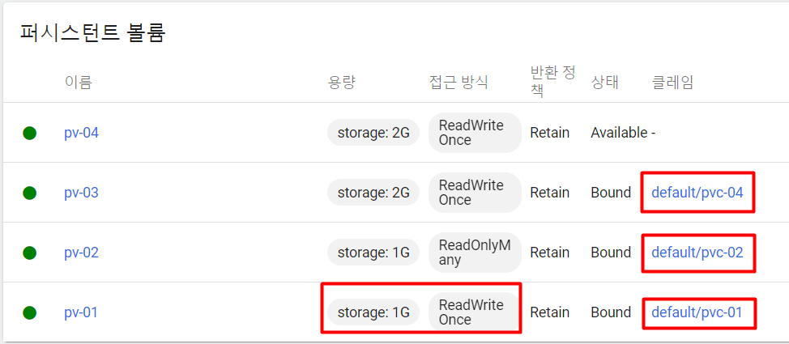{: .border .normal w="800" h="650" }  
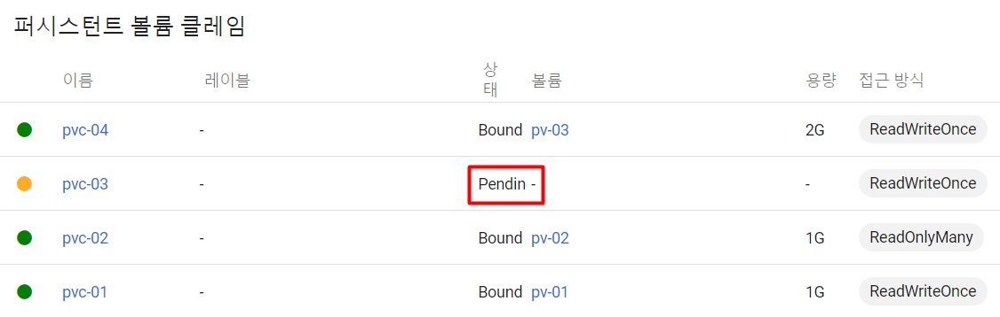{: .border .normal w="800" h="650" }  
 - **한번 바인딩된 PV는 다른 클레임(PVC)에서 사용할 수 없다.**
 - PV ↔ PVC의 연결은 `accessModes`와 `storage`를 매핑하여 바인딩된다. 
   - PV storage > PVC storage가 큰 경우, PV의 storage로 강제 바인딩
   - PV storage < PVC storage가 큰 경우, 바인딩이 실패하고 Pending 상태 유지

## ConfigMap, Secret
개발, 운영 등 환경에 따라 변경되는 상수를 **ConfigMap**, 보안적인 관리가 필요한 비밀키는 **Secret**으로 생성하여 이용한다.    
Pod 생성 시, ConfigMap과 Secret 오브젝트를 연결할 수 있고 컨테이너 환경변수로 오브젝트 데이터를 넘길 수 있다.
동일한 이미지를 사용하여도 환경변수 값을 통해 여러 환경을 커버할 수 있게 된다.  

### Env Literal
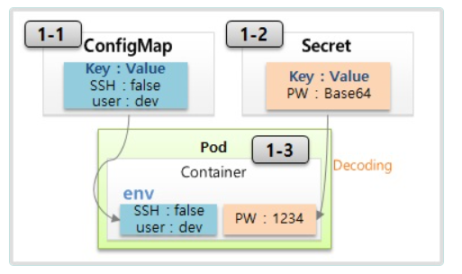{: .border .normal w="600" h="450" }
 - key:value로 구성된 상수
 - Pod 생성 시, 컨테이너 안의 환경변수에 세팅하는 방식
 - `Secret`의 경우 value는 Base64로 인코딩되어야 하며, 실제 컨테이너로 value가 주입될 때 디코딩된 값이 주입된다.
 - `Secret`의 데이터는 보안을 위해 Memory에 저장되고 1Mbyte 상한선이 존재한다.

```yaml
# ConfigMap 생성
apiVersion: v1
kind: ConfigMap
metadata:
  name: cm-dev # 생성할 Configmap 명
data:
  SSH: 'false' # 기본값은 String 타입이고 boolean의 경우 quotation이 필요함
  User: dev
```

```yaml
# Secret 생성
apiVersion: v1
kind: Secret
metadata:
  name: sec-dev # 생성할 Secret 명
data:
  Key: MTIzNA== # base64 인코딩 값
```

```yaml
apiVersion: v1
kind: Pod
metadata:
  name: pod-1
spec:
  containers:
  - name: container
    image: kubetm/init
    envFrom:
    - configMapRef: # ConfigMap Reference
        name: cm-dev # 사용할 Configmap 명
    - secretRef: # Secret Reference
        name: sec-dev # 사용할 Secret 명
```

### Env File
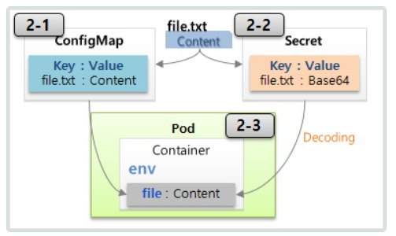{: .border .normal w="600" h="450" }
 - `file명`이 key가 되고 `file내용`이 value가 된다.
 - `kubectl create configmap cm-file --from-file=./file.txt`
 - `kubectl create secret sec-file --from-file=./file.txt`
   - `secret`의 경우 파일 안의 내용은 자동으로 base64로 인코딩되기 때문에 인코딩된 값을 넣을 필요가 없다.

```yaml
apiVersion: v1
kind: Pod
metadata:
  name: pod-file
spec:
  containers:
  - name: container
    image: kubetm/init
    env:
    - name: file-c
      valueFrom:
        configMapKeyRef:
          name: cm-file
          key: file-c.txt
    - name: file-s
      valueFrom:
        secretKeyRef:
          name: sec-file
          key: file-s.txt
```
### Volume Mount File
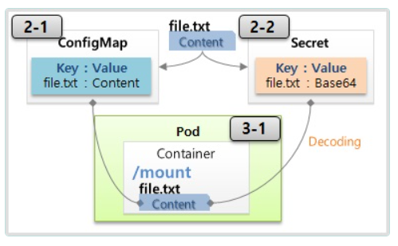{: .border .normal w="600" h="450" }
 - ConfigMap file, Secret file을 컨테이너 내부에 마운트하여 사용하는 방식
 - **ConfigMap, Secret에 변경이 되면 이미 환경변수로 주입된 `Env File` 방식은 영향이 없지만 `Volume Mount File`은 변경사항도 마운트가 된다. 이런 특성을 잘 사용하면 유연한 구성을 만들 수 있다.** 
```yaml
apiVersion: v1
kind: Pod
metadata:
  name: pod-mount
spec:
  containers:
  - name: container
    image: kubetm/init
    volumeMounts:
    - name: file-volume
      mountPath: /mount # 마운트할 경로
  volumes:
  - name: file-volume
    configMap:
      name: cm-file # 마운트할 볼륨은 ConfigMap / Secret file을 사용한다.
```

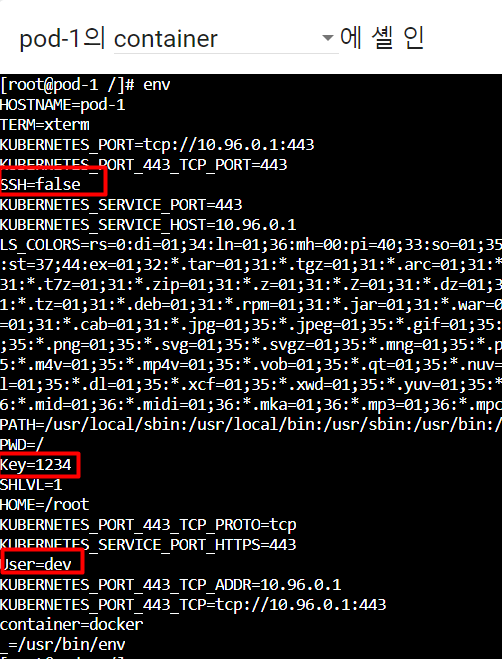{: .border .normal w="350" h="550" }  
 - 인코딩했던 `Secret` 값이 디코딩되어 환경변수로 주입된 것을 확인할 수 있다.

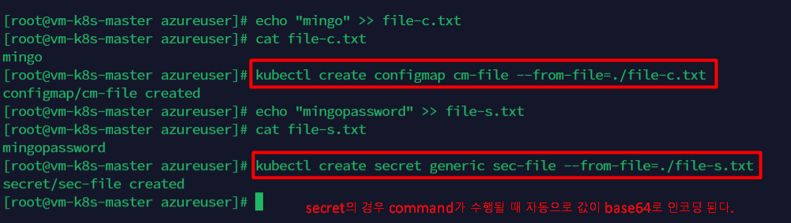{: .border .normal w="800" h="450" }  
{: .border .normal w="400" h="650" }  
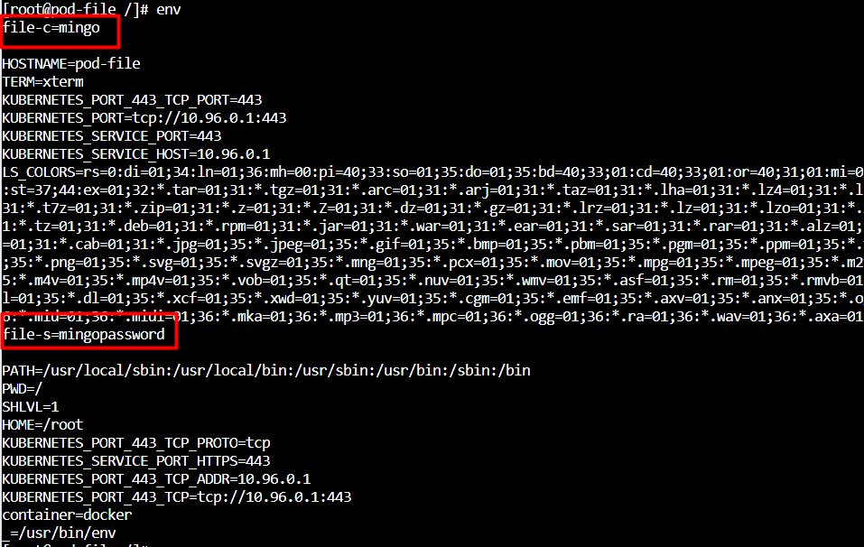{: .border .normal w="350" h="550" }  
 - key는 `file이름` value는 `file내용`

## Namespace, ResourceQuota, LimitRange
ing...

-----

### source
- <https://www.inflearn.com/course/%EC%BF%A0%EB%B2%84%EB%84%A4%ED%8B%B0%EC%8A%A4-%EA%B8%B0%EC%B4%88/>
